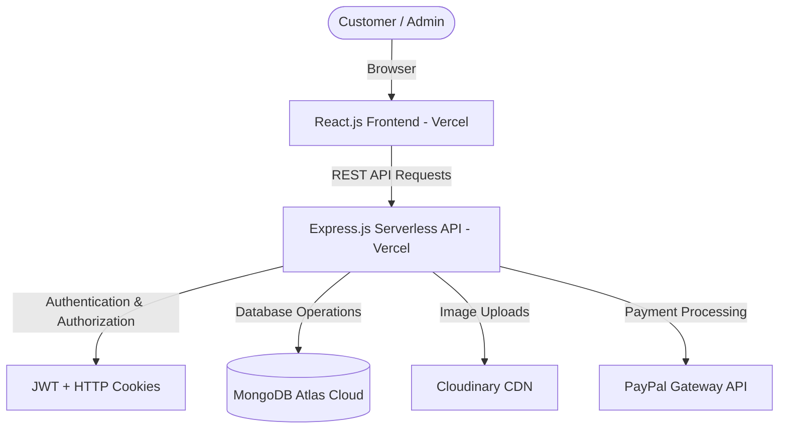

# 🛒 Vastraalay — Full-Stack MERN E-Commerce Application


**Vastraalay** is a modern, production-ready full-stack E-Commerce web application built using the MERN stack (MongoDB, Express.js, React.js, Node.js). It features complete Admin product & order management, customer shopping workflows, Cloudinary image hosting, JWT cookie authentication, and payment integration.

---

## 🌐 Live Demo & Credentials

* 🔗 **Live Web Application:** [https://e-commerce-app-sigma-nine.vercel.app/](https://e-commerce-app-sigma-nine.vercel.app/) *(Replace with your Vercel URL)*
* 📁 **Postman API Collection:** [`E-Commerce.postman_collection.json`](./E-Commerce.postman_collection.json)
* 📘 **Interview Explanation Guide:** [`MERN_Ecommerce_Interview_Explanation.md`](./MERN_Ecommerce_Interview_Explanation.md)

### 🔑 Test Accounts (Quick Demo):
| Role | Email | Password |
| :--- | :--- | :--- |
| **Admin** | `admin@gmail.com` | `admin123` |
| **Customer** | `user@gmail.com` | `user123` |

---

## ✨ Key Features

### 👑 Admin Management Panel
* 📦 **Product Management:** Complete CRUD operations (Add, Edit, Delete, Fetch) with real-time stock updates.
* 🖼️ **Cloudinary Image Upload:** Drag-and-drop product image uploading directly to Cloudinary CDN.
* 📋 **Order Management:** View all customer orders, filter order details, and update shipment/delivery status (`pending` ➔ `inProcess` ➔ `inShipping` ➔ `delivered`).
* 🎯 **Banner Slider Control:** Add/delete promotional banner images displayed on the homepage slider.

### 🛍️ Customer Shopping Experience
* 🔍 **Product Browsing & Filtering:** Filter products by category, brand, and sort by price or title.
* 🛒 **Cart & Wishlist:** Real-time quantity updates, cart calculation, and stock validation.
* 📍 **Address Management:** Add, edit, and delete multiple delivery addresses per user account.
* 💳 **Checkout & Payments:** Support for both **Cash on Delivery (COD)** and **PayPal Sandbox** checkout flows.
* 🌟 **Product Reviews:** Write and read product ratings and user feedback.
* 🔎 **Instant Search:** Dynamic keyword search across products.

---

## 🛠️ Tech Stack & Architecture

### **Frontend**
* **Framework:** React.js (Vite)
* **State Management:** Redux Toolkit (Async Thunks)
* **Styling:** Tailwind CSS + Shadcn UI + Lucide Icons
* **HTTP Client:** Axios (with credentials)

### **Backend**
* **Runtime:** Node.js & Express.js (Serverless Architecture on Vercel)
* **Database:** MongoDB Atlas with Mongoose ODM
* **Authentication:** JWT (JSON Web Tokens) with HTTP-Only Cookies & Bcrypt Password Hashing
* **Cloud Storage:** Cloudinary SDK
* **Payment Gateway:** PayPal Server SDK

---

## 📐 System Architecture



---

## 🚀 Local Development Setup

### 1. Prerequisites
* Node.js (v18 or higher)
* Git & MongoDB Atlas Connection String

### 2. Clone Repository
```bash
git clone https://github.com/rahulprakash0898/E-Commerce-App.git
cd E-Commerce-App
```

### 3. Server Setup (`/server`)
```bash
cd server
npm install
```
Create a `.env` file in `/server`:
```env
PORT=5000
MONGODB_URL=your_mongodb_atlas_connection_string
ACCESS_TOKEN_SECRET=your_access_token_secret
REFRESH_TOKEN_SECRET=your_refresh_token_secret
CLOUDINARY_CLOUD_NAME=your_cloudinary_cloud_name
CLOUDINARY_API_KEY=your_cloudinary_api_key
CLOUDINARY_API_SECRET=your_cloudinary_api_secret
PAYPAL_CLIENT_ID=your_paypal_client_id
PAYPAL_CLIENT_SECRET=your_paypal_client_secret
PAYPAL_MODE=sandbox
```
Run backend server:
```bash
npm run dev
```

### 4. Client Setup (`/client`)
```bash
cd ../client
npm install
```
Create a `.env` file in `/client`:
```env
VITE_API_URL=http://localhost:5000/api/v1
```
Run frontend dev server:
```bash
npm run dev
```
Open `http://localhost:5173` in your browser.

---

## 🛡️ Security Best Practices Implemented
* 🔐 **Bcrypt Hashing:** Passwords are never stored in plain text.
* 🛡️ **HTTP-Only Cookies:** Auth tokens stored in HTTP-Only cookies to protect against XSS token theft.
* 🚫 **Git Security:** All `.env` configuration files and sensitive keys are explicitly listed in `.gitignore` and excluded from source control.
* ⚙️ **Strict Control Scoping:** Server-side price and stock validation during checkout.

---

## 📄 License
Distributed under the MIT License. See `LICENSE` for more information.

---
**Made with ❤️ by [Rahul Prakash](https://github.com/rahulprakash0898)**
